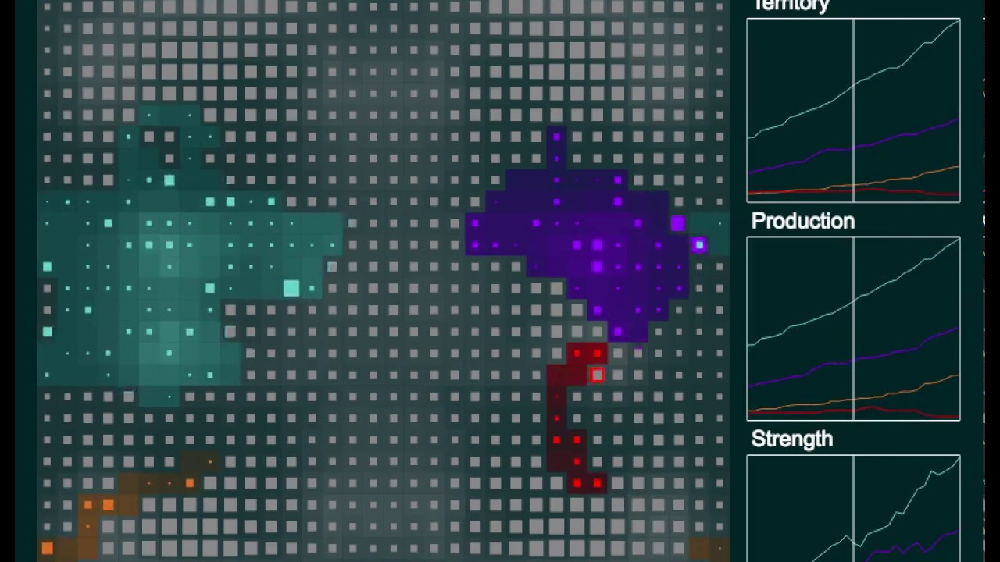

# Project_PA

Important info:

1. Implemented in C++ a Halite bot with an Runtime Engine integrated within a framework given by the organisers of the project.

2. The goal of the implementation is to efficiently save the bo strength such that the highest score cells will be attacked first. A Greedy approach was used to achieve this.

3. Obtained the 1st prize of the Champions League Competition which was hosted by POLYTECHNIC University of Bucharest, Faculty of Automatic Control and Computers.

Credits to [Andrei Buhnici](https://github.com/AndreiBuhnici) for giving me advices and ideas.
